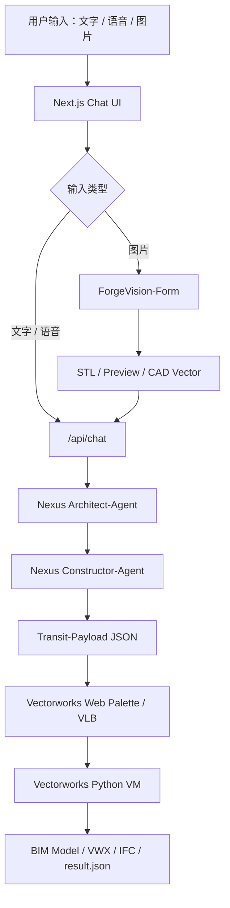

# openBIMForge

**面向建筑信息模型（BIM）的多模态智能生成与 Vectorworks 原生构筑系统**

openBIMForge 是一个将自然语言、语音指令与建筑草图转化为 BIM 构筑任务的生成式 Agent 系统。项目以 **Nexus 多智能体编排框架** 为核心，通过 Architect-Agent、Constructor-Agent 与 Vectorworks VM 执行层协同，把用户的建筑意图转化为可在专业 BIM 软件中运行的原生 Python 构筑脚本，并完成模型生成、IFC 导出与结果回写。

该版本已打通从 Web 交互、LLM 规划、ForgeVision 图像理解、CAD-First 矢量约束，到 Vectorworks 物理执行的完整链路，可作为 **AI + BIM 自动建模方向的工程原型、毕业论文系统与面试展示项目**。

## 项目亮点

### 1. Nexus 多智能体 BIM 编排

系统将 BIM 生成拆分为“语义规划”和“物理构筑”两个阶段：

- **Architect-Agent**：理解建筑需求，补全空间逻辑、层数、功能区、体量关系与设计约束。
- **Constructor-Agent**：将规划结果转化为 Vectorworks Python 构筑代码，生成墙体、楼板、空间、核心筒、屋顶与构件。
- **Stage4 Vectorworks VM**：在 Vectorworks 宿主环境中真实执行 `vs.*` 调用，避免外部 Python 伪执行。

### 2. Text-to-BIM 全链路

支持通过自然语言描述生成 BIM，例如：

> 生成一栋 6 层办公楼，面积 4200 平方米，层高 3.6 米，以开放办公为主，包含会议室、核心筒和屋顶设备层。

系统会自动完成需求识别、Agent 编排、Payload 交付、Vectorworks 执行与结果同步。

### 3. ForgeVision-Form 图像形体链路

系统支持上传建筑草图、体量图或概念图，通过 ForgeVision-Form 解析视觉形体，生成：

- 预览图（Preview）
- 三维体量参考（STL）
- CAD 矢量序列（cad_vector.json）

这些结果会作为 `ForgeVisionConstraints` 自动注入 Nexus，让 LLM 不再只依赖文字描述，而能参考视觉体量进行 BIM 重构。

### 4. CAD-First 高精度矢量构筑

当图像解析得到的 CAD vector 复杂度达到阈值时，系统会自动进入 **CAD-First** 模式：

- 读取 `complexity_score`
- 提取关键坐标点 `[CAD_COORDINATES]`
- 强制 Constructor-Agent 使用 polygon / slab / wall 逻辑
- 减少“白模化”和简单 Box 生成
- 提升复杂退台、异形轮廓、组合体量的几何贴合度

### 5. Vectorworks 真实物理执行闭环

系统采用 `Transit-Payload` 文件协议连接 Web 与 Vectorworks：

1. Web / Python 编排层生成 `nexus_payload_*.json`
2. Vectorworks Web Palette 轮询 pending payload
3. VLB 插件调用 Vectorworks Python VM
4. `vectorworks_execute.py` 在 VM 内执行构筑代码
5. 写回 `.result.json`
6. 前端状态卡片同步完成结果

该机制实现了 Web UI 与专业 BIM 宿主之间的异步解耦。

### 6. 工程级状态对账

为避免 Stage4 异步执行误报失败，系统引入 pending 文件机制：

- `.result.json.pending.json`：表示 payload 已交付，等待 Vectorworks VM 回写
- `.result.json`：表示 VM 已完成真实执行
- 前端在等待期间显示“等待 VM 回写”，不会把正常等待误判为失败

## 当前已实现

- 文本输入 → Nexus → Vectorworks BIM 生成
- 语音转文字 → 文本 BIM 链路
- 图片上传 → ForgeVision-Form → Nexus
- CAD vector → CAD-First 高精度分支
- Transit-Payload 异步交付
- Vectorworks Web Palette / VLB / VM 执行闭环
- `.result.json` 结果回写与前端状态同步
- 前端隐藏技术 JSON，展示 ForgeVision 几何约束卡片
- PowerShell 开发日志降噪与关键节点输出

## 当前规划

下一阶段重点是 **ForgeVision-Layout**：

- 识别平面图中的房间、走廊、门窗、核心筒和功能分区
- 输出 `rooms / walls / doors / adjacency / corridor / core` 空间拓扑 JSON
- 将空间拓扑注入 Nexus，让 Constructor 生成真正的室内布局和房间墙线

当前 ForgeVision-Layout 尚未完整实现，现阶段已完成的是 ForgeVision-Form 与 CAD-First 形体链路。

## 系统架构



## 核心目录

```text
app/api/chat/                         # Nexus 编排入口、需求判断、流式响应
app/api/bim/forge-architect-visionary # ForgeVision-Form 图片解析 API
app/api/bim/forge-architect-runner    # Vectorworks Web Palette 查询 pending payload
app/api/bim/forge-architect-result    # 前端轮询 VM result.json
components/chat-panel.tsx             # 聊天、语音、图片上传、ForgeVision 自动提交
components/chat-message-display.tsx   # Nexus 状态卡片、ForgeVision 卡片、结果展示
forge_core/layout_agent/              # ForgeVision-Form Python 适配层
forge_core/build_agent/               # Nexus 编排、Transit-Payload、VM 执行
forge_core/design_agent/muti_agent_prompt/ # Architect / Constructor 基础提示词
vectorworks_plugin/                   # Vectorworks Web Palette 与 VLB 桥接
forge_runtime/handoffs/               # 本地运行时 payload / pending / result 文件
```

## 技术栈

- **Frontend**：Next.js, React, Vercel AI SDK, Tailwind CSS
- **Backend**：Next.js Route Handlers, Node.js, Python Bridge
- **Agent Runtime**：Python, OpenAI-compatible SDK, 多模型路由
- **Vision Pipeline**：ForgeVision-Form, GenCAD-compatible adapter, STL / CAD vector
- **BIM Runtime**：Vectorworks 2024+, Vectorworks Python SDK
- **Protocol**：Transit-Payload JSON, `.pending.json`, `.result.json`

## 快速启动

```bash
npm install
npm run dev
```

图片链路需要配置 ForgeVision-Form 外部引擎：

```env
OPENBIMFORGE_LAYOUT_ENGINE_ROOT=...
OPENBIMFORGE_LAYOUT_ENTRYPOINT=...
OPENBIMFORGE_LAYOUT_PYTHON=...
```

Vectorworks 物理执行需要安装并打开 `vectorworks_plugin` 中的 Web Palette / VLB 插件。

## 推荐验证流程

1. 输入一段纯文字建筑需求，确认 Nexus Stage 1/2/3/4 正常推进。
2. 上传简单体量图片，确认 ForgeVision-Form 返回 preview / STL / CAD vector。
3. 上传复杂退台图片，确认触发 CAD-First。
4. 打开 Vectorworks Web Palette，确认 pending payload 被 VM 拉取执行。
5. 检查 `forge_runtime/handoffs` 中 pending 文件被真实 `.result.json` 替换。

## 详细文档

- [openBIMForge Nexus 全链路说明](docs/openBIMForge%20Nexus%20全链路说明.md)
- [openBIMForge 文档清理计划](docs/openBIMForge%20文档清理计划.md)
- [Vectorworks 插件安装说明](docs/VECTORWORKS_PLUGIN_INSTALL.md)
- [全链路测试说明](docs/FULL_CHAIN_TEST.md)

## 项目定位

openBIMForge 不是简单的“文本生成脚本”Demo，而是一个围绕 BIM 真实生产环境设计的多阶段 Agent 系统。它的核心价值在于：

- 将 LLM 生成能力约束到可执行 BIM 工程流程中
- 将 Web 交互与 Vectorworks 宿主环境解耦
- 将图片、CAD 矢量和建筑语义统一注入模型生成链路
- 为 Text-to-BIM、Image-to-BIM、CAD-to-BIM 的融合提供可运行原型

该项目适合用于展示 AI Agent、BIM 自动化、建筑生成设计、多模态交互和工程软件集成能力。
