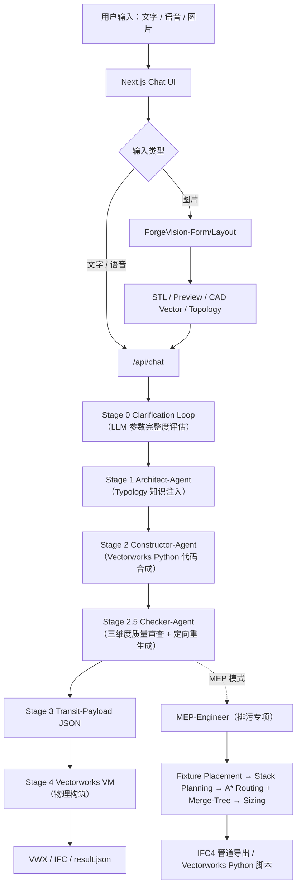

# openBIMForge

> **Generative BIM framework that turns natural-language briefs into native Vectorworks models and IFC drainage assets.**
>
> Multi-agent LLM orchestration • Neurosymbolic MEP routing • Typology-aware knowledge injection • Quality-gated regeneration

openBIMForge 把自然语言、体量草图和平面图转化为可在 **Vectorworks** 中执行的 BIM 生成任务，并在同一流水线里协同生成**排污 MEP 系统（IFC4）**。系统以 **Nexus 多智能体编排框架**为核心，打通了从语义需求、典型学知识注入、约束代码合成、质量审查到物理构筑的完整链路。

---

## 项目亮点

| 能力 | 说明 |
|------|------|
| **多智能体 BIM 编排** | Architect-Agent（规划）→ Constructor-Agent（代码）→ Checker-Agent（审查）→ Transit-Payload → Vectorworks VM |
| **可切换 LLM** | 支持 20+ 提供商（OpenAI、Anthropic、DeepSeek、LongCat、Qwen、Ollama、Vertex AI、Bedrock…），每个 Agent 可独立指定模型 |
| **Typology 知识注入** | 10 种建筑类型（办公 / 住宅 / 学校 / 医院 / 酒店 / 商场 / 工业 / 宿舍 / 别墅 / 默认）的结构化参数库，替代硬编码默认值 |
| **三维度质量评估** | 需求符合度 + 几何合理性 + BIM 语义丰富度，阈值触发 Checker-Agent 定向重生成 |
| **MEP 排污专项**（创新点） | Fixture 定位 → Stack 聚类 → A\* 带约束横管路由 → Merge-Tree 合流拓扑 → GB 50015 查表定径 → 通气/清扫口补全 → IFC4 导出 |
| **跨模态输入** | 文字 / 语音 / 体量图 / 平面图 / CAD 向量，经 ForgeVision 归一化为几何约束 |
| **透明可审计** | Claude Code 风格折叠执行流，每个阶段产出可溯源的 JSON / 代码 / IFC 工件 |

---

## 系统架构



系统由两条独立但可协同的智能体链路组成：

- **建筑主链路（Nexus）**：Clarification → Architect → Constructor → Checker → Transit → Vectorworks VM。每步都产出可审计的中间产物（槽位、代码、三维度质量评分、IFC）。
- **MEP 分支**（可选启用）：读取 Architect 产出的建筑 state，独立完成排污系统设计，输出独立 IFC，可脱离 Vectorworks 单独验证（Solibri / ifc.js / BIMvision）。

---

## 技术栈

- **前端**：Next.js 16（App Router）· React 19 · Tailwind CSS v4 · Radix UI · Vercel AI SDK v6
- **后端编排**：Next.js Route Handlers · Node.js · Python Bridge（通过 child_process 调用）
- **LLM 提供商**：统一适配 OpenAI / Anthropic / Google / Vertex AI / Bedrock / Azure / DeepSeek / OpenRouter / SiliconFlow / SGLang / Ollama / Gateway / EdgeOne / LongCat / 豆包 / ModelScope / GLM / Qwen / 七牛 / Kimi / MiniMax
- **Python Agent Runtime**：Python 3.11+ · OpenAI-compatible SDK · Anthropic SDK · Google GenAI SDK
- **MEP 算法**：A\* 约束路径规划 · Prim 最小生成树（合流拓扑）· 自适应 K-means 立管聚类
- **BIM 运行时**：Vectorworks 2024+ · Vectorworks Python SDK（`vs.*`）· IFC4（手写 SPF 导出，零依赖）
- **可观测性**：Langfuse LLM Tracing · OpenTelemetry
- **包管理**：`uv`（Python）· `npm`（Node）
- **部署**：Cloudflare Workers（`@opennextjs/cloudflare`）· Vercel · Docker · 腾讯 EdgeOne

---

## 核心目录

```text
app/
  api/chat/                         # Nexus 编排入口、澄清循环、流式响应
  api/bim/forge-architect-*         # BIM 生成 API（能力扫描、结果轮询、构件下载）
  bim/                              # Vectorworks 控制台 / IFC 预览页面
components/
  chat-panel.tsx                    # 主聊天面板（文字 / 语音 / 图片 / MEP 开关）
  chat-message-display.tsx          # Claude Code 风格可折叠执行卡片
  settings-dialog.tsx               # Agent 模型专业化配置（高级）
forge_core/
  knowledge/                        # Typology 知识包 + MEP 器具字典
    typologies/*.json               # 10 种建筑类型参数库
    mep_fixtures.json               # GB 50015 器具 / 管径查表
    loader.py                       # 查表 + fallback 解析器
  build_agent/                      # Nexus 编排 + Checker + 质量评估 + VM 执行
    unified_runtime.py              # 主流水线，Agent 模型专业化
    nexus_checker.py                # 阈值 + 单次重生成
    quality_evaluator.py            # 三维度静态评分
  mep_agent/                        # MEP 排污专项（独立可运行）
    fixture_placer.py               # Stage B 规则式器具定位
    stack_planner.py                # Stage C 自适应 K-means 立管聚类
    pipe_router.py                  # Stage D A* + 梁避让
    merge_tree.py                   # Prim 合流拓扑
    sizing.py                       # Stage E 管径 / 通气 / 清扫口
    ifc_exporter.py                 # 无依赖 IFC4 SPF 输出
    quality.py                      # 连通 / 坡度 / 管径 / 规范四维评估
    mep_pipeline.py                 # 顶层编排器
  layout_agent/                     # ForgeVision 图像 / 草图适配层
  design_agent/                     # Architect / Constructor 提示词 + VS API stub
benchmark/                          # MEP 定量评测集（3 个 case 起步）
  cases/                            # BuildingPlan JSON
  run_benchmark.py                  # CLI：跑所有 case 输出 Markdown / CSV / JSON
tests/mep/                          # 21 个单元测试（Prim / A* / IFC / 四维评分）
vectorworks_plugin/                 # Vectorworks Web Palette + VLB 桥接
```

---

## 快速启动

### 安装依赖

```bash
# Node 端
npm install

# Python 端（推荐 uv）
uv sync --extra dev
```

### 启动开发服务器

```bash
npm run dev
# 浏览器访问 http://localhost:6002/zh
```

### 独立运行 MEP 生成（不依赖 Vectorworks）

```bash
uv run -m forge_core.mep_agent \
    --input forge_core/mep_agent/examples/office_6f_demo.json \
    --output forge_runtime/mep_out --ifc --script
```

产出 `demo_office_6f.ifc`，可直接拖进 Solibri、BIMvision、[ifc.js](https://ifcjs.github.io/web-ifc-viewer/example/index.html) 预览三维管道。

### 跑 benchmark 评测

```bash
uv run -m benchmark.run_benchmark --format markdown
# 结果：forge_runtime/benchmark/summary.md
```

### 跑单元测试

```bash
uv run pytest tests -v
```

---

## Agent 模型专业化（提升生成质量的关键设计）

每个子 Agent 都可以独立指定提供商 / 模型，系统会自动路由：

- **Architect-Agent**（空间规划、建筑学常识）→ 推理型模型（Claude Opus / o3 / DeepSeek R1）
- **Constructor-Agent**（生成 Vectorworks Python 代码）→ 代码专项模型（Qwen2.5-Coder / Claude Sonnet / DeepSeek Coder）
- **Checker-Agent**（三维度评分 + 单次重生成）→ 轻量模型（Haiku / 本地 Ollama）

三个 Agent 留空都会回退到主模型，确保单模型用户无感知。这种 **Model Specialization** 策略让"用一个中等模型 + 一个便宜模型"的组合效果接近"全部用最贵的顶级模型"。

---

## 评测数据（节选）

| Case | Fixtures | Stacks | 管段数 | 管长 | 质量 |
|------|---------:|-------:|-------:|-----:|-----:|
| 6 层办公楼 | 51 | 1 | 54 | 52.50 m | 100/100 |
| 单层 4 户住宅板 | 20 | 2 | 28 | 56.29 m | 100/100 |
| 4 层教学楼 | 55 | 2 | 63 | 84.75 m | 100/100 |

评测维度：`connectivity`（器具连通率）· `slope`（坡度合规）· `sizing`（管径合规）· `code_compliance`（GB 50015 通气 / 清扫口）。

---

## 详细文档

- [MEP 排污 Agent（独立模块说明）](forge_core/mep_agent/README.md)
- [MEP Benchmark 评测集](benchmark/README.md)

---

## License

Apache-2.0
