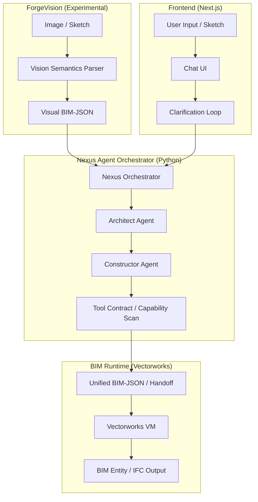
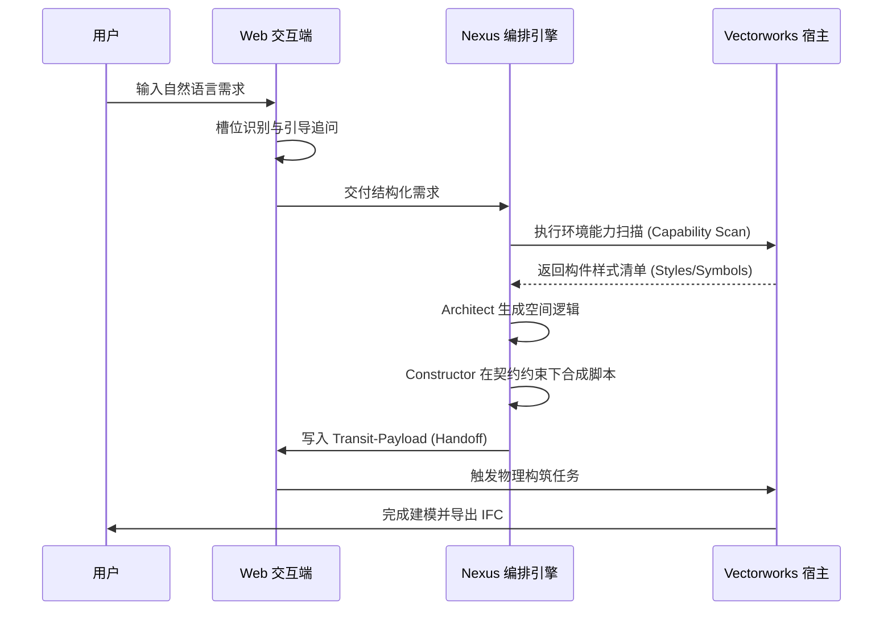

# openBIMForge

## 项目简介

openBIMForge 是一个面向建筑信息模型（BIM）自动化的生成式 Agent 编排系统。它通过多智能体协同机制，将用户的自然语言需求或模糊设计意图转化为工业级 BIM 软件（如 Vectorworks）中的结构化建模任务。

该系统集成了 **ForgeVision** 视觉输入实验链路，支持从建筑草图提取视觉语义，并结合意图澄清环（Clarification Loop）实现高精度的 BIM 实体自动合成，旨在大幅降低 BIM 建模的专业门槛与重复劳动。

## 核心亮点

### 1. Clarification Loop：槽位填充式意图澄清
通过预设的 Slot-filling 机制（如建筑类型、层数、层高、面积等），自动识别并追问缺失的关键建模参数，确保在进入编排阶段前实现语义对齐。

### 2. Multi-Agent Workflow：Architect / Constructor / Fixer 多智能体协作
采用角色解耦的架构：Architect Agent 负责顶层空间规划与设计逻辑；Constructor Agent 专注于在物理环境下合成高鲁棒性的 BIM 构筑代码；具备基础的自愈反馈闭环。

### 3. Tool Contract：基于 Capability Scan 的构件幻觉抑制
在生成前动态扫描 Vectorworks 宿主环境的构件库（Styles/Symbols），建立“工具契约”，通过 Prompt 约束强制 LLM 仅使用环境内存在的构件，有效抑制专业幻觉。

### 4. Unified LLM Router：多模型动态路由
封装统一的模型适配层，支持根据任务复杂度在 OpenAI、Claude、Gemini 及本地部署的 Qwen/Llama 模型间无缝切换，兼顾推理能力与响应成本。

### 5. Payload / Handoff：Web 与 BIM Runtime 异步解耦
设计了轻量化的 Transit-Payload 协议，通过 JSON 载荷实现 Web 交互端与重型 BIM 执行引擎（Vectorworks VM）的物理隔离与异步任务交付。

### 6. Vectorworks Runtime：真实 BIM 引擎执行与 IFC 输出
通过 Python-BIM 桥接层直接驱动专业 BIM 引擎进行构筑，支持 15+ 种核心构件自动生成，并可一键导出标准 IFC 格式文件。

### 7. ForgeVision：视觉输入实验链路
实验性的 Image-to-BIM 通路，支持对建筑草图进行语义解析，识别体块关系、立面元素与材料线索，为后续的生成链路提供多模态参考。

## 系统架构



## 工作流程



## ForgeVision 视觉输入链路

ForgeVision 是 openBIMForge 中面向草图 / 图片输入的实验性视觉链路（Experimental Pathway），用于将建筑草图解析为结构化视觉语义，并进一步转换为 Visual BIM-JSON，作为后续生成链路的补充输入。

**主要功能与特性：**
- **语义解析**：识别建筑类型（如住宅、办公）、体块关系（L型、U型、悬挑等）及立面构件。
- **元素提取**：从草图线条中提取门、窗、阳台及遮阳板等立面元素的相对位置。
- **材料推断**：解析草图中的材质阴影与纹理（如石材、木材、混凝土线索）。
- **参数对齐**：支持将视觉识别结果与文本槽位（Slots）自动合并，降低用户重复输入成本。
- **原型定位**：目前作为 openBIMForge 的重要概念原型（Prototype），用于探索 Image-to-BIM 领域的技术边界。

## 技术栈

- **Frontend**: Next.js 15, Vercel AI SDK, Tailwind CSS, Lucide React, Framer Motion
- **Backend / Runtime**: Python 3.11, OpenAI SDK, Langfuse (Tracing & Observability)
- **LLM / Agent**: GPT-4o, Claude 3.5, Gemini 1.5, Qwen (via Ollama)
- **BIM Runtime**: Vectorworks 2024+, VectorScript (Python SDK)
- **Data Protocol**: Transit-Payload (JSON), Unified BIM-JSON 1.0
- **Tooling**: Biome (Linting), Docker, Cloudflare OpenNext

## 目录结构

```text
openBIMForge/
├── app/                  # Next.js 路由与 API 实现
├── components/           # 前端 UI 组件库
├── forge_core/           # 核心 Agent 编排逻辑 (Python)
│   ├── build_agent/      # 物理构筑 Agent (Constructor)
│   ├── design_agent/     # 建筑规划 Agent (Architect)
│   └── layout_agent/     # 布局生成 Agent
├── forge_runtime/        # 运行时目录 (handoffs, logs, state)
├── lib/                  # 共享库 (BIM 逻辑, 澄清环等)
├── tool_agent/           # BIM 工具集封装
├── vectorworks_plugin/   # Vectorworks 侧插件实现
├── requirements.txt      # Python 环境依赖
└── package.json          # Node.js 环境依赖
```

## 快速开始

### Development Setup

1. **环境准备**：
   - 安装 Node.js 20+ 与 Python 3.11+。
   - 确保已安装 Vectorworks 2024 或更高版本。

2. **安装依赖**：
   ```bash
   npm install
   pip install -r requirements.txt
   ```

3. **配置环境变量**：
   复制 `.env.example` 为 `.env.local`，填入您的 OpenAI/Claude API Key。

4. **启动前端服务**：
   ```bash
   npm run dev
   ```

5. **启动后端 Bridge**：
   后端逻辑由前端通过 `child_process` 自动调用，但需确保本地 Python 命令在环境变量中或在 `.env.local` 中配置 `OPENBIMFORGE_PYTHON_COMMAND`。

6. **Vectorworks 集成**：
   将 `vectorworks_plugin` 中的插件安装至 Vectorworks User Folder，并启动 Web Palette 监听任务载荷。

## 示例 Payload (Unified BIM-JSON)

```json
{
  "schema_version": "Nexus-BIM-JSON 1.0",
  "semantic_slots": {
    "building_type": "Office",
    "storey_count": 3,
    "target_area_m2": 500,
    "floor_height_m": 4.0
  },
  "generation": {
    "status": "draft",
    "mode": "live",
    "handoff_path": "forge_runtime/handoffs/nexus_payload_20240506.json"
  },
  "execution_config": {
    "executionMode": "vectorworks"
  }
}
```

## 当前状态

| 模块 | 状态 | 说明 |
| :--- | :--- | :--- |
| **Text-to-BIM 主链路** | Prototype | 已打通从需求到 Vectorworks 的全链路构筑 |
| **Clarification Loop** | Prototype | 支持 4 大核心维度的槽位识别与追问 |
| **Tool Contract** | Prototype | 支持墙、门、窗、楼板样式的实时能力扫描 |
| **Vectorworks Runtime** | Prototype | 稳定支持 15+ 种 BIM 实体的生成接口 |
| **ForgeVision** | Experimental | 视觉语义解析入口已建立，待深度联动 |
| **多模型动态路由** | Prototype | 支持主流商用模型与本地 Ollama 模型切换 |

## Roadmap

1. **Vision-BIM 深度联动**：完善 ForgeVision 视觉语义到 BIM 构件属性的细粒度自动映射。
2. **构件库扩充**：增强 Tool Contract 覆盖范围，支持更复杂的幕墙系统与暖通构件。
3. **自愈能力增强**：完善自我修正闭环（Fixing Loop）的错误分类库，支持更复杂的几何逻辑修复。
4. **多端适配**：扩展对 Revit (pyRevit) 及 BlenderBIM 的适配器支持。

## License

License TBD. (Apache-2.0 Recommended)
