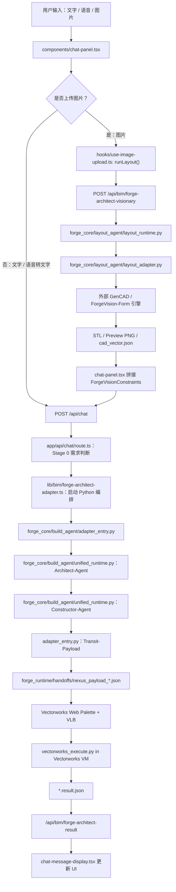
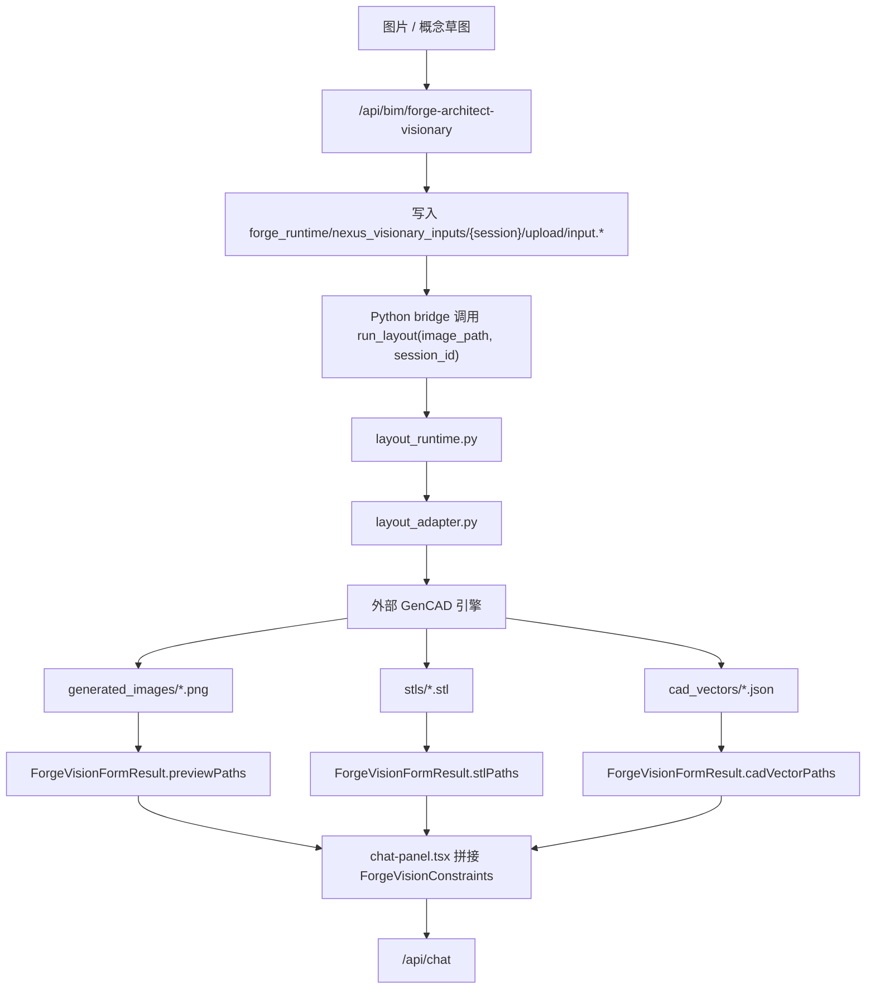
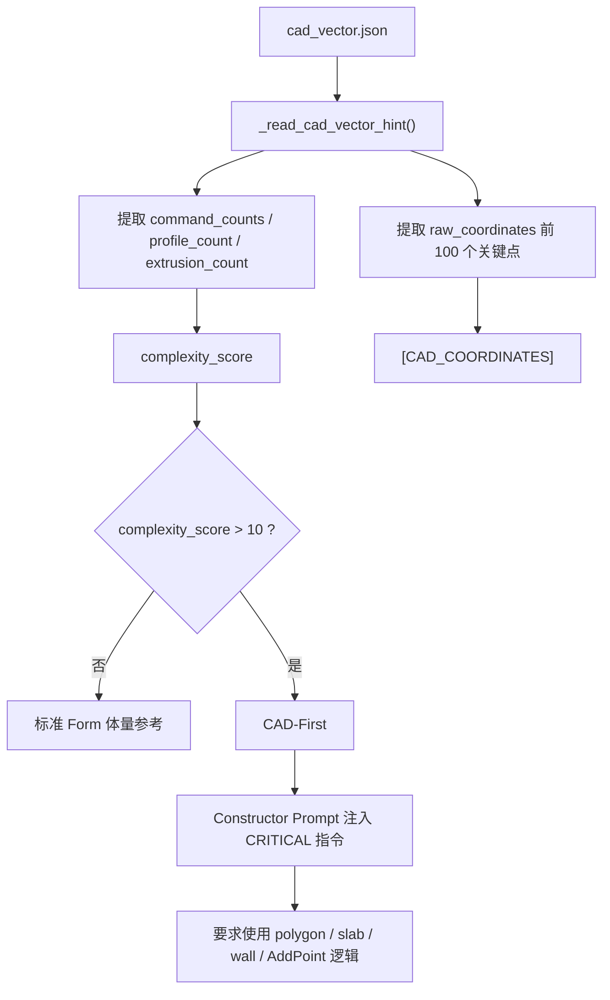
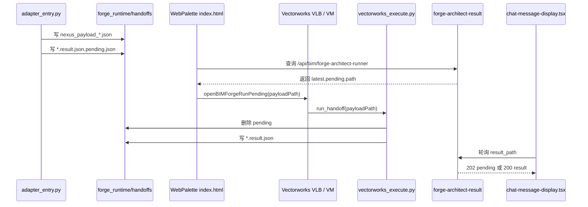

# openBIMForge Nexus 全链路说明

本文档是当前 openBIMForge 的权威链路地图，用于论文、交接、调试和后续开发。它描述的是当前代码事实，不是设想稿。

## 1. 当前系统边界

openBIMForge 当前已经打通三条核心能力：

1. **Text-to-BIM**：文字或语音转文字后，进入 Nexus 多 Agent 编排，最终在 Vectorworks VM 中生成 BIM。
2. **ForgeVision-Form**：图片或概念草图转体量参考，输出 STL、预览图和 CAD vector，再进入 Nexus。
3. **CAD-First**：ForgeVision-Form 的高精度分支。当 CAD vector 的复杂度足够高时，Constructor-Agent 优先使用坐标点生成 polygon、slab、wall 等原生 BIM 元素。

尚未完整实现：

1. **ForgeVision-Layout**：平面图、房间布局、走廊、门窗、核心筒、空间邻接关系识别。当前只有概念和部分命名基础，没有可验收的完整链路。

## 2. 总体全链路图



## 3. 前端入口

### 3.1 文字与语音

用户在聊天框输入文字，或通过语音输入转成文字。最终都由 `sendMessage()` 发送到 `/api/chat`。

关键源码：

- `components/chat-panel.tsx:130`：`useVoiceInput()` 接入语音输入。
- `components/chat-panel.tsx:144`：`useChat()` 初始化聊天流。
- `components/chat-panel.tsx:237`：普通文本消息发送。
- `app/api/chat/route.ts:387`：后端聊天请求入口。

语音链路本质上不是单独 BIM 路线，它只是把语音转成文本，然后走 Text-to-BIM。

### 3.2 图片上传

图片上传后先进入 ForgeVision-Form，不直接进入 Nexus。

关键源码：

- `hooks/use-image-upload.ts:61`：`runLayout()` 调用图片解析 API。
- `app/api/bim/forge-architect-visionary/route.ts:196`：图片解析 API 入口。
- `components/chat-panel.tsx:336`：点击或自动触发 ForgeVision-Form。
- `components/chat-panel.tsx:400`：ForgeVision-Form 成功后自动提交 Nexus。

## 4. ForgeVision-Form 已实现链路

ForgeVision-Form 解决的是“建筑外形、体量、轮廓、退台、异形形体”的视觉参考问题。



关键源码：

- `app/api/bim/forge-architect-visionary/route.ts:154`：Node API 通过 Python 命令调用 `run_layout()`。
- `app/api/bim/forge-architect-visionary/route.ts:230`：读取 `cadVectorPaths`。
- `app/api/bim/forge-architect-visionary/route.ts:245`：构建 `forgeVisionConstraints`。
- `app/api/bim/forge-architect-visionary/route.ts:260`：返回 `ForgeVisionFormResult`。
- `forge_core/layout_agent/layout_runtime.py:24`：ForgeVision-Form Python 运行时入口。
- `forge_core/layout_agent/layout_adapter.py:36`：读取 `OPENBIMFORGE_LAYOUT_ENGINE_ROOT`、`OPENBIMFORGE_LAYOUT_ENTRYPOINT`、`OPENBIMFORGE_LAYOUT_PYTHON`。

### 4.1 ForgeVision-Form 输出

当前 Form 输出分三类：

1. `previewPaths`：图片预览，用于 UI 和 LLM 参考。
2. `stlPaths`：三维体量参考，用于估算尺度、面积、高度。
3. `cadVectorPaths`：CAD 指令序列，用于 CAD-First 高精度分支。

类型定义：

- `lib/bim/visionary-types.ts:1`：`ForgeVisionFormResult`
- `lib/bim/visionary-types.ts:22`：`NormalizedVisionaryResult = ForgeVisionFormResult`，这是兼容旧命名。

## 5. CAD-First 高精度分支

CAD-First 不是独立入口，它是 ForgeVision-Form 内部的高精度分支。

触发条件：

- ForgeVision-Form 产出 `cad_vector.json`。
- `unified_runtime.py` 读取后计算 `complexity_score`。
- 当 `complexity_score > 10`，Constructor-Agent 被注入 `[CRITICAL: VECTOR-DRIVEN SYNTHESIS]` 指令。



关键源码：

- `forge_core/build_agent/unified_runtime.py:144`：计算 `complexity_score`。
- `forge_core/build_agent/unified_runtime.py:192`：读取 `cadVectorPaths`。
- `forge_core/build_agent/unified_runtime.py:240`：把复杂度写入 ForgeVision 上下文。
- `forge_core/build_agent/unified_runtime.py:250`：拼接 `[CAD_COORDINATES]`。
- `forge_core/build_agent/unified_runtime.py:268`：解析 `complexity_score`。
- `forge_core/build_agent/unified_runtime.py:751`：`complexity_score > 10` 触发 CAD-First。
- `forge_core/build_agent/unified_runtime.py:754`：注入 `[CRITICAL: VECTOR-DRIVEN SYNTHESIS]`。

## 6. Nexus 多 Agent 编排

Nexus 采用分段式架构：

1. Stage 0：需求完整度判断、追问或跳过追问。
2. Stage 1：Architect-Agent 生成建筑语义规划。
3. Stage 2：Constructor-Agent 生成 Vectorworks Python 代码。
4. Stage 3：Transit-Payload 写入 handoffs。
5. Stage 4：Vectorworks VM 读取 payload 并执行。

### 6.1 Stage 0：需求判断

关键源码：

- `app/api/chat/route.ts:153`：检测 ForgeVision 上下文。
- `app/api/chat/route.ts:157`：从 ForgeVision 文本提取 `complexity_score`。
- `app/api/chat/route.ts:171`：构造 CAD-First 或标准图生 BIM 的整备说明。
- `app/api/chat/route.ts:443`：ForgeVision 上下文命中后跳过机械追问。
- `lib/bim/clarification-loop.ts:261`：构造需求整备状态文本。

### 6.2 Stage 1 / Stage 2

关键源码：

- `forge_core/build_agent/unified_runtime.py:582`：`run_nexus_architect_pipeline()` 入口。
- `forge_core/build_agent/unified_runtime.py:610`：加载 Architect/Product Owner 基础提示词。
- `forge_core/build_agent/unified_runtime.py:613`：追加 ForgeVision-Form 解释规则。
- `forge_core/build_agent/unified_runtime.py:619`：加载 Constructor/Coder 基础提示词。
- `forge_core/build_agent/unified_runtime.py:620`：追加 Constructor 约束规则。
- `forge_core/build_agent/unified_runtime.py:687`：Architect stage event。
- `forge_core/build_agent/unified_runtime.py:731`：Constructor 开始生成 Vectorworks Python。

## 7. Prompt 位置总表

### 7.1 基础 Agent Prompt

- `forge_core/design_agent/muti_agent_prompt/po_chat_prompt_temp.txt:1`
  - Architect / Product Owner 角色。
  - 负责把用户需求扩展成建筑逻辑和程序员指令。

- `forge_core/design_agent/muti_agent_prompt/coder_chat_prompt_temp.txt:1`
  - Constructor / Coder 角色。
  - 负责输出可执行 Python 代码。

- `forge_core/design_agent/muti_agent_prompt/floor_plan_designer_chat_prompt_few_shots.txt:1`
  - 平面设计 few-shot。
  - 目前主要作为设计辅助，不等同于完整 ForgeVision-Layout。

- `forge_core/design_agent/muti_agent_prompt/checker_chat_prompt_temp.txt:1`
  - 失败修复 / reviewer prompt。

### 7.2 运行时追加 Prompt

- `forge_core/build_agent/unified_runtime.py:613`
  - ForgeVision-Form interpretation rules。
  - 要求从视觉参考推断面积、层数、体量，不允许轻易返回 unknown。

- `forge_core/build_agent/unified_runtime.py:620`
  - Constructor constraints。
  - 要求原生 BIM 元素、避免本地路径泄露、使用 walls/slabs/spaces/roofs/storeys。

- `forge_core/build_agent/unified_runtime.py:754`
  - CAD-First CRITICAL 指令。
  - 要求 Constructor 使用 `[CAD_COORDINATES]`，优先 polygon / slab / wall。

### 7.3 前端注入 Prompt

- `components/chat-panel.tsx:264`
  - `submitForgeVisionFormToNexus()`。

- `components/chat-panel.tsx:279`
  - `【ForgeVisionConstraints】` 原始 JSON 注入位置。

这段 prompt 是真正把 ForgeVision-Form 结果带入 Nexus 的地方。

## 8. Transit-Payload 与 Stage4

Stage4 是最容易误判的部分。当前设计原则是：外部 Python 只负责生成 payload，不执行 `vs.*`；真正执行必须发生在 Vectorworks VM 内部。



关键源码：

- `forge_core/build_agent/adapter_entry.py:117`：`prepare_nexus_transit_payload()`。
- `forge_core/build_agent/adapter_entry.py:162`：写入 `execution_config.resultPath`。
- `forge_core/build_agent/adapter_entry.py:170`：写入 `.pending.json`。
- `app/api/bim/forge-architect-runner/route.ts:99`：识别 pending payload。
- `vectorworks_plugin/openBIMForge2024/WebPaletteTUM.vwr/html/index.html:400`：Web Palette 轮询 pending。
- `vectorworks_plugin/openBIMForge2024/WebPaletteTUM.vwr/html/index.html:431`：调用 `openBIMForgeRunPending()`。
- `forge_core/build_agent/vectorworks_execute.py:649`：VM 内执行入口 `run_handoff()`。
- `forge_core/build_agent/vectorworks_execute.py:711`：确定 `result_path`。
- `forge_core/build_agent/vectorworks_execute.py:764`：删除 pending。
- `app/api/bim/forge-architect-result/route.ts:143`：前端轮询时读取 pending 状态。

## 9. ForgeVision-Layout 未完成部分

ForgeVision-Layout 不是 Form 的重命名，它是另一条任务类型：

- Form：识别建筑外形和体量。
- Layout：识别平面空间和功能关系。

### 9.1 Layout 目标输出

未来 Layout 应该输出类似结构：

```json
{
  "source": "forgevision-layout",
  "status": "completed",
  "layoutConstraints": {
    "scale": "unknown_or_estimated",
    "rooms": [
      {
        "id": "room-1",
        "name": "Open Office",
        "type": "office",
        "polygon": [[0, 0], [12, 0], [12, 8], [0, 8]],
        "area_m2": 96
      }
    ],
    "walls": [],
    "doors": [],
    "windows": [],
    "cores": [],
    "corridors": [],
    "adjacency": []
  }
}
```

### 9.2 当前缺口

1. 类型缺口：
   - 当前只有 `ForgeVisionFormResult`。
   - 位置：`lib/bim/visionary-types.ts:1`。
   - 需要新增 `ForgeVisionLayoutResult`。

2. API 分发缺口：
   - 当前 `/api/bim/forge-architect-visionary` 默认都走 Form。
   - 位置：`app/api/bim/forge-architect-visionary/route.ts:196`。
   - 需要增加 `mode=form|layout`。

3. Python 适配器缺口：
   - 当前 `layout_agent` 实际是 Form 后端适配器。
   - 位置：`forge_core/layout_agent/layout_runtime.py:24`。
   - 需要新增独立 `plan_adapter.py` 或 `layout_topology_runtime.py`。

4. Prompt 缺口：
   - 当前 prompt 已强化 Form 和 CAD-First。
   - 还缺少 `ForgeVision-Layout interpretation rules`。
   - 需要告诉 Architect/Constructor 如何使用 `rooms / walls / doors / adjacency`。

5. 前端入口缺口：
   - 当前图片上传没有明确选择 Form/Layout。
   - 位置：`components/chat-panel.tsx` 上传区。
   - 需要增加“形体 Form / 平面 Layout”模式选择。

## 10. ForgeVision-Layout 最小实现计划

不要一开始就上复杂模型。建议分三步：

### Step 1：接口骨架

- 新增 `ForgeVisionLayoutResult`。
- API 支持 `mode=form|layout`。
- 前端上传图片时可以选择模式。
- 默认仍为 `form`，避免破坏已通链路。

验收标准：

- 选择 Form，原链路完全不变。
- 选择 Layout，API 返回结构化 layout JSON。

### Step 2：规则化 Layout MVP

先不依赖大模型视觉分割，先做可控 MVP：

- 输入平面图。
- 输出规则化 rooms / walls / doors / adjacency 示例结构。
- 用户文字可以补充“开放办公、会议室、核心筒”等功能信息。
- Nexus 能读取 Layout JSON 并生成空间墙体和房间对象。

验收标准：

- `ForgeVisionLayoutConstraints` 能进入 `/api/chat`。
- `unified_runtime.py` 能识别 Layout 上下文。
- Constructor 生成墙线、房间、门洞或功能分区。

### Step 3：替换视觉模型

后续再接更强模型：

- 平面图 OCR / 语义分割。
- 房间检测。
- 门窗识别。
- 走廊和核心筒识别。
- adjacency graph 构建。

## 11. 测试矩阵

### 11.1 Text-to-BIM

输入：

```text
生成一栋 6 层办公楼，面积 4200 平方米，层高 3.6 米，以开放办公为主，包含会议室和核心筒。
```

预期：

- 进入 Nexus Stage 1/2/3/4。
- 生成 handoff payload。
- Vectorworks VM 写回 `.result.json`。

### 11.2 ForgeVision-Form 标准图生 BIM

输入：

- 上传简单建筑体量图。

预期：

- `[ForgeVision-Form] result ... preview>=1`
- 如果 `complexity_score <= 10`，不触发 CAD-First。
- 仍然进入 Nexus。

### 11.3 ForgeVision-Form + CAD-First

输入：

- 上传复杂退台或多轮廓图。

预期：

- `[ForgeVision-Form] result ... stl=1 ... cadVector=1`
- PowerShell 出现“高精度矢量模式”。
- handoff payload 的 query 包含 `[CAD_COORDINATES]`。
- `code_result` 倾向出现 polygon / slab / wall / AddPoint 逻辑。

### 11.4 Stage4 VM

预期文件：

- `forge_runtime/handoffs/nexus_payload_*.json`
- `forge_runtime/handoffs/nexus_payload_*.result.json.pending.json`
- VM 执行后生成 `nexus_payload_*.result.json`
- pending 文件被删除。

## 12. 文档维护原则

当前项目存在旧文档乱码和 Text2BIM 残留。后续文档应遵循：

1. 以本文档为主链路权威说明。
2. README 只保留项目简介、快速启动、核心文档链接。
3. 旧 Text2BIM 说明移入 legacy 或标记 deprecated。
4. 不要在 README 中直接堆长链路，避免再次过期。
5. 每次改 Stage4、ForgeVision、Prompt，都同步更新本文档对应章节。
